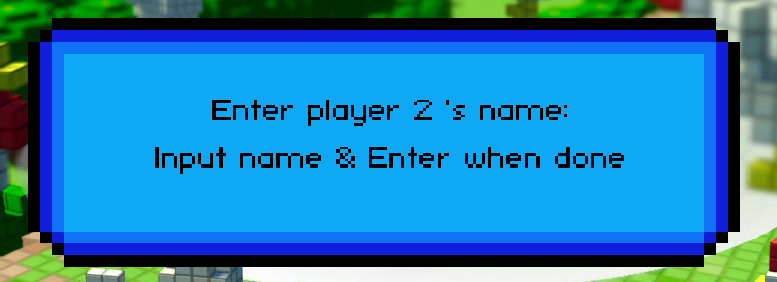
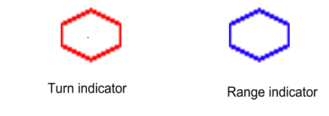
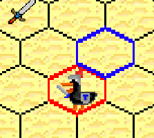
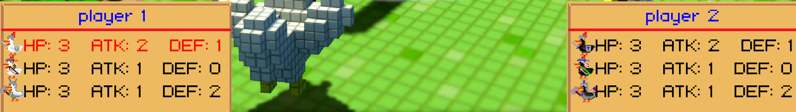

1.  Press Start to begin

    {width="6.5in"
    height="3.2194641294838147in"}

2.  Type in player 1 's name

> Enter to complete
>
> {width="6.5in"
> height="2.662182852143482in"}

3.  Type in player 2 's name

> Enter to complete
>
> {width="6.5in"
> height="2.359027777777778in"}

4.  Game start

    Player 1 has 3 white chicken and Player 2 has 3 black chicken.

    {width="6.5in"
    height="2.458840769903762in"}Map will random automatically like:

    **Rules**

> Each player will take turn to move 1 of their chickens, starting with
> player 1. The red hexagon surrounding the tile will indicate which
> chicken is allowed to move, which is also indicated as the stats line
> turn red in the table. As the player moves the mouse across the map, a
> blue hexagon will show that the chicken is allowed to move or attack
> there, which is dependent on the chicken's range.
>
> {width="4.96875in"
> height="1.7604166666666667in"}
>
> {width="2.345138888888889in"
> height="2.2569444444444446in"}{width="2.4867257217847767in"
> height="2.230530402449694in"}
>
> **Chicken stats table**
>
> {width="6.5in"
> height="1.429073709536308in"}
>
> These stats will update continuously; you can see changes through
> stats table below the playground:
>
> {width="6.5in"
> height="0.9195494313210849in"}
>
> **Attack**
>
> When you click on another chicken, one popup will display between 2
> stats table
>
> {width="5.132638888888889in"
> height="3.3006944444444444in"}
>
> Click on the attack text if you want to attack and not if you don't
> want to do so.
>
> ***Opponent's HP = Opponent's HP + Opponent's DEF -- Your ATK***
>
> ***Opponent's DEF = Opponent's DEF -- Your ATK (if its DEF is greater
> than your ATK)***
>
> There is one way to increase your Stats: Pick Item
>
> **Item**
>
> Each kind of Item will give you a bonus stat point when you pick it up
> (click on it)
>
> {width="0.3333333333333333in"
> height="0.3333333333333333in"} +1 HP
>
> {width="0.3333333333333333in"
> height="0.3333333333333333in"} +1 DEF
>
>  +1 ATK
>
> **Win Condition**
>
> When one player killed all enemy's chickens, he will count as Victory
> and the Win box popup with his name on it.
