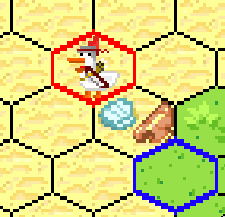

#Game Guide

1.  Press Start to begin

> 

2.  Type in player 1 's name

> Enter to complete

> 

3.  Type in player 2 's name

> Enter to complete

> 

4.  Game start

> Player 1 has 3 white chicken and Player 2 has 3 black chicken.
>
> Map will random automatically like:

 

   **Rules**

> Each player will take turn to move 1 of their chickens, starting with
> player 1. The red hexagon surrounding the tile will indicate which
> chicken is allowed to move, which is also indicated as the stats line
> turn red in the table. As the player moves the mouse across the map, a
> blue hexagon will show that the chicken is allowed to move or attack
> there, which is dependent on the chicken's range.
>
> 
>
> 
> 
>
> **Chicken stats table**
>
> 

> These stats will update continuously; you can see changes through
> stats table below the playground:
>
> 

  **Attack**
>
> When you click on another chicken, one popup will display between 2
> stats table
>
> 

> Click on the attack text if you want to attack and not if you don't
> want to do so.
>
> ***Opponent's HP = Opponent's HP + Opponent's DEF -- Your ATK (if its DEF is 
> smaller than your ATK)*** 
>
> ***Opponent's DEF = Opponent's DEF -- Your ATK (if its DEF is greater
> than your ATK)***
>
> There is one way to increase your Stats: Pick Item
>
  **Item**
>
> Each kind of Item will give you a bonus stat point when you pick it up (click on it)
>
>                 **+1 HP**
>
>                 **+1 DEF**
>
>                  **+1 ATK**
>
  **Win Condition**
>
> When one player killed all enemy's chickens, he will count as Victory
> and the Win box popup with his name on it.
